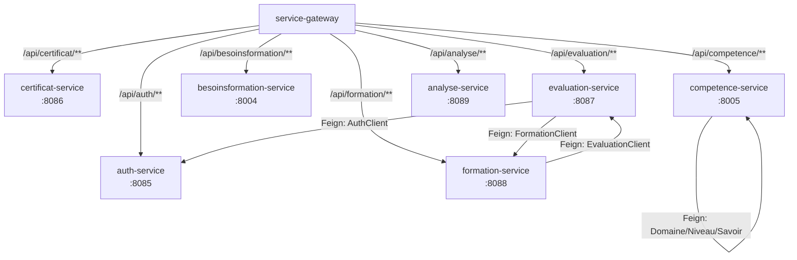
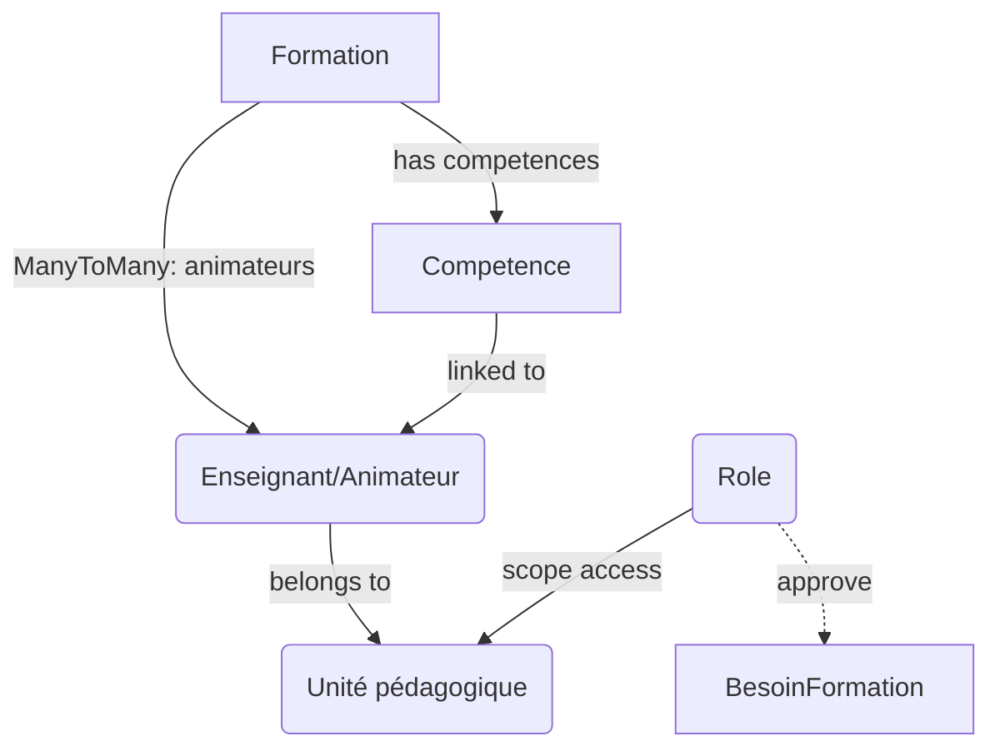

# Rapport des services et de leurs relations

Résumé extrait du code du dépôt (fichiers `application.properties`, annotations `@FeignClient`, et configuration du gateway).

## Services principaux

- **service-gateway** (esprit_D2F-api-gateway)
  - port: 8080
  - rôle: point d'entrée HTTP central (Spring Cloud Gateway)
  - routes connues: auth-service, certificat-service, evaluation-service, formation-service, besoinsformation-service, competence-service, analyse-service

- **auth-service** (esprit_D2F-authentification)
  - port: 8085
  - rôle: authentification / gestion JWT

- **certificat-service** (esprit_D2F-certificat)
  - port: 8086

- **evaluation-service** (esprit_D2F-evaluation)
  - port: 8087
  - dépendances (Feign): `formation-service`, `auth-service`

- **formation-service** (esprit_D2F-formation)
  - port: 8088
  - dépendances (Feign): `evaluation-service`

- **besoinsformation-service** (esprit_D2F-besoin-formation)
  - port: 8004

- **competence-service** (esprit_D2F-competence)
  - port: 8005
  - dépendances (Feign): services `Domaine`, `Niveau`, `Savoir` (clients déclarés dans le module)

- **service-analyse / analyse-service** (esprit_D2F-analyse)
  - port: 8089

- Autres modules présents (à vérifier selon besoin): `esprit_D2F-common-security`, `esprit_D2F-predictive-analytics` (Python), `esprit_D2F-rice`, `esprit_D2F-webapp`, etc.

## Relations notables

- Le `service-gateway` redirige les chemins publics `/api/{service}/**` vers les services backend (ex: `/api/auth/**` → `auth-service:8005`).
- Plusieurs services utilisent Feign pour appels inter-services :
  - `formation-service` appelle `evaluation-service` (client `EvaluationClient`).
  - `evaluation-service` appelle `formation-service` et `auth-service` (clients `FormationClient`, `AuthClient`).
  - `competence-service` appelle `Domaine`, `Niveau`, `Savoir` via clients Feign.

Ces dépendances forment un graphe d'appels intra-backend où le gateway est la porte d'entrée.

## Diagramme simplifié (Mermaid)

## Remarques et points à vérifier

- Certains modules ont des différences entre noms de service (ex: `service-analyse` vs `analyse-service`) selon fichiers. Confirmer la convention utilisée en production.
- Les ports et URIs visibles proviennent des `application.properties` dans le dépôt; des variables d'environnement et fichiers `-prod`/`-qa` peuvent rediriger vers des noms Docker différents (ex: `auth-service:8005`).
- Pour une cartographie exhaustive je peux :
  1) parcourir tous les fichiers Java pour lister tous les `@FeignClient` (et leurs `name`/`url`),
  2) agréger toutes les routes du gateway (tous profils),
  3) générer un diagramme plus complet (format PNG/SVG) et une table CSV.

---
Rapport généré automatiquement — dites-moi si vous voulez que j'affine (ajouter tous les modules, extraire controllers REST, ou produire PNG). 

## Attributs détaillés par service

- service-gateway (esprit_D2F-api-gateway)
  - `spring.application.name`: service-gateway
  - `server.port`: 8080
  - routes: `/api/auth/**`, `/api/certificat/**`, `/api/evaluation/**`, `/api/formation/**`, `/api/besoinsformation/**`, `/api/competence/**`, `/api/analyse/**`

- auth-service (esprit_D2F-authentification)
  - `spring.application.name`: auth-service
  - `server.port`: 8085
  - datasource: `currentSchema=auth` (PostgreSQL, configurable via `DB_URL`)
  - dépendances: `d2f-common-security`

- certificat-service (esprit_D2F-certificat)
  - `spring.application.name`: certificat-service
  - `server.port`: 8086
  - datasource: `currentSchema=certificat` (PostgreSQL)
  - dépendances: `d2f-common-security`

- evaluation-service (esprit_D2F-evaluation)
  - `spring.application.name`: evaluation-service
  - `server.port`: 8087
  - datasource: `currentSchema=evaluation` (PostgreSQL)
  - Feign clients: `formation-service`, `auth-service`
  - dépendances: `d2f-common-security`

- formation-service (esprit_D2F-formation)
  - `spring.application.name`: formation-service
  - `server.port`: 8088
  - datasource: `currentSchema=formation` (PostgreSQL)
  - Feign clients: `evaluation-service`
  - dépendances: `d2f-common-security`

- besoinsformation-service (esprit_D2F-besoin-formation)
  - `spring.application.name`: besoinsformation-service
  - `server.port`: 8004
  - datasource: `currentSchema=besoin` (PostgreSQL)
  - dépendances: `d2f-common-security`

- competence-service (esprit_D2F-competence)
  - `spring.application.name`: competence-service
  - `server.port`: 8005
  - datasource: `currentSchema=competence` (PostgreSQL)
  - Feign clients: `Domaine`, `Niveau`, `Savoir`
  - dépendances: `d2f-common-security`

- analyse-service (esprit_D2F-analyse)
  - `spring.application.name`: service-analyse / service-analyse (vérifier)
  - `server.port`: 8089
  - datasource: non détectée dans `application.properties` (vérifier si service sans base ou config externe)
  - dépendances: `d2f-common-security`

## Points communs

- Sécurité & auth: la plupart des backends importent `d2f-common-security` — gestion centralisée des règles RBAC / JWT.
- Connexions DB: services persistants utilisent PostgreSQL (configurable via variables `DB_URL`, `DB_USER_*`, `DB_PASSWORD_*`) ; tests utilisent H2 en mémoire.
- Communication inter-services: Feign est utilisé pour appels synchrones (ex: `evaluation <-> formation`, `evaluation -> auth`).
- Gateway: routes exposent tous les services via `/api/{service}/**` et appliquent des filtres (StripPrefix, RewritePath) — le gateway est le point d'entrée public.
- Configuration par profil: `application-qa.properties`, `application-prod.properties` définissent hôtes/ports Docker différents (ex: `auth-service:8005`, `competence-service:8005`).

---
Mise à jour effectuée: j'ai ajouté les attributs et points communs identifiés. Voulez-vous que j'extraie maintenant tous les fichiers Java contenant `@FeignClient` et produise un CSV récapitulatif ?

## Relations domaine — Formation / Compétence / Animateur / CUP

- **Formation ↔ Compétence**: les formations sont liées aux compétences (consultation et filtrage possible via les endpoints de `competence-service` et `formation-service`). Exemple d'API: `GET /api/v1/competences/{id}/enseignants` (retourne enseignants associés à une compétence) — montre un lien opérationnel entre compétences et enseignants/formation.

- **Formation ↔ Animateur (Enseignant)**: la documentation et le modèle de données définissent `Formation.animateurs : List<EnseignantRef>` (relation Many-To-Many). Les animateurs sont des comptes `Enseignant` référencés par `formation` (table relationnelle `formation_animateur` / `seance_animateur` dans les scripts/SQL). Frontend et controllers passent des listes `animateurs` pour l'édition et l'affichage des formations.

- **Animateur — attributs importants**: `id`, `nom`, `prenom`, `mail`, `up` (unité pédagogique), `departement` (dept), rôles (ex: `ANIMATEUR`, `ENSEIGNANT`). Le `up` permet de lier un enseignant à une unité pédagogique.

- **CUP (Coordinateur Unité Pédagogique)**: `CUP` est un rôle (ROLE_CUP) avec droits de validation — p.ex. les entités `BesoinFormation` possèdent le champ `approuveCUP` (nullable boolean) permettant au rôle CUP d'approuver/rejeter une demande. Les règles d'accès du gateway et des services incluent `CUP` dans les matrices d'autorisation (ex: endpoints `by-up/{up}` accessibles à `CUP`).

- **Résumé relationnel (Mermaid)**

Notes:
- `CUP` est un rôle, pas un service — il contrôle des validations (`approuveCUP`) et a accès aux endpoints par `up`.
- Les preuves dans le dépôt: `docs/data-contract-dsi-*.html` (définitions de `CUP`, `approuveCUP`, permissions), entités Java (`BesoinFormation.propositionAnimateur`, `Certificate.roleEnFormation`) et composants frontend (`FormationWorkflow*`, `SessionEditor`, `CalendarEnseignant`).

## Détails techniques complets (extraits automatiques)

### 1) Feign clients (appelés services et fichiers)
- `esprit_D2F-evaluation` -> `FormationClient` — @FeignClient(name = "formation-service", url = "${services.formation.url:http://localhost:8088}") — [esprit_D2F-evaluation/src/main/java/esprit/pfe/serviceevaluation/client/FormationClient.java](esprit_D2F-evaluation/src/main/java/esprit/pfe/serviceevaluation/client/FormationClient.java#L7)
- `esprit_D2F-evaluation` -> `AuthClient` — @FeignClient(name = "auth-service", url = "${services.auth.url:http://localhost:8085}") — [esprit_D2F-evaluation/src/main/java/esprit/pfe/serviceevaluation/client/AuthClient.java](esprit_D2F-evaluation/src/main/java/esprit/pfe/serviceevaluation/client/AuthClient.java#L7)
- `esprit_D2F-formation` -> `EvaluationClient` — @FeignClient(name = "evaluation-service", url = "${EVALUATION_SERVICE_URL:http://localhost:8087}") — [esprit_D2F-formation/src/main/java/esprit/pfe/serviceformation/feign/EvaluationClient.java](esprit_D2F-formation/src/main/java/esprit/pfe/serviceformation/feign/EvaluationClient.java#L11)
- `esprit_D2F-formation` (worktree) -> `EvaluationClient` — @FeignClient(name = "evaluation-service", contextId = "evaluationClient") — [.claude worktree path](.claude/worktrees/agent-a546e336a8320fcdc/esprit_D2F-formation/src/main/java/esprit/pfe/serviceformation/feign/EvaluationClient.java#L11)
- `esprit_D2F-competence` -> `DomaineClient` — @FeignClient(name = "Domaine", url = "http://localhost:8002") — [.claude worktree path](.claude/worktrees/agent-a546e336a8320fcdc/esprit_D2F-competence/src/main/java/tn/esprit/d2f/clients/DomaineClient.java#L8)
- `esprit_D2F-competence` -> `NiveauClient` — @FeignClient(name = "Niveau", url = "http://localhost:8003") — [.claude worktree path](.claude/worktrees/agent-a546e336a8320fcdc/esprit_D2F-competence/src/main/java/tn/esprit/d2f/clients/NiveauClient.java#L8)
- `esprit_D2F-competence` -> `SavoirClient` — @FeignClient(name = "Savoir", url = "http://localhost:8005") — [.claude worktree path](.claude/worktrees/agent-a546e336a8320fcdc/esprit_D2F-competence/src/main/java/tn/esprit/d2f/clients/SavoirClient.java#L8)

### 2) Routes du gateway (profiles: default / qa / prod)
- Profile `default` / local (application.properties)
  - `/api/auth/**` → http://localhost:8085 (auth-service)
  - `/api/certificat/**` → http://localhost:8086 (certificat-service)
  - `/api/evaluation/**` → http://localhost:8087 (evaluation-service)
  - `/api/formation/**` → http://localhost:8088 (formation-service)
  - `/api/ai/**` → http://localhost:8000 (ai-reco-service)
  - `/api/besoinsformation/**` → http://localhost:8004 (besoinsformation-service)
  - `/api/competence/**` → http://localhost:8001 (competence-service)

- Profile `qa` (application-qa.properties)
  - `/api/auth/**` → http://auth-service:8005
  - `/api/certificat/**` → http://certificat-service:8086
  - `/api/evaluation/**` → http://evaluation-service:8087
  - `/api/formation/**` → http://formation-service:8088
  - `/api/besoinsformation/**` → http://besoinsformation-service:8004
  - `/api/competence/**` → http://competence-service:8005 (RewritePath applied)
  - `/api/analyse/**` → http://analyse-service:8089

- Profile `prod` (application-prod.properties)
  - same services but URIs use service discovery (`lb://...`) in many entries (ex: `lb://AUTH-SERVICE`, `lb://COMPETENCE-SERVICE`, etc.). Voir les fichiers: [esprit_D2F-api-gateway/src/main/resources/application-qa.properties](esprit_D2F-api-gateway/src/main/resources/application-qa.properties#L15) et [esprit_D2F-api-gateway/src/main/resources/application-prod.properties](esprit_D2F-api-gateway/src/main/resources/application-prod.properties#L12).

### 3) Contrôleurs REST (extraits par service)
- `esprit_D2F-formation`: controllers clés — `FormationController`, `FormationWorkflowController`, `FormationCompetenceController`, `EnseignantController`, `UpController`, `SeanceController`, `InscriptionController` — (voir dossier [esprit_D2F-formation/src/main/java/esprit/pfe/serviceformation/controllers](esprit_D2F-formation/src/main/java/esprit/pfe/serviceformation/controllers#L1)).
- `esprit_D2F-competence`: controllers — `CompetenceController`, `EnseignantCompetenceController`, `DomaineController`, `SavoirController`, `SousCompetenceController`, `StructureController`.
- `esprit_D2F-evaluation`: controllers — `EvaluationGlobaleController`, `EvaluationFormateurController`, `AdminController`.
- `esprit_D2F-besoin-formation`: controllers — `BesoinFormationController`, `BesoinCompetenceController`, `AdminController`.
- `esprit_D2F-authentification`: controllers — `AccountController`, `SecurityController`, websocket `NotificationController`.
- `esprit_D2F-certificat`: controllers — `CertificateController`, `CertificatePdfController`, `AdminController`.

### 4) Ports principaux et schémas DB (récapitulatif)
- `service-gateway` : port 8080 (ou 8222 dans certains worktrees)
- `auth-service` : port 8085 — schema: `auth` (spring.datasource.currentSchema=auth)
- `certificat-service` : port 8086 — schema: `certificat`
- `evaluation-service` : port 8087 — schema: `evaluation`
- `formation-service` : port 8088 — schema: `formation`
- `besoinsformation-service` : port 8004 — schema: `besoin`
- `competence-service` : port 8005 (worktree: 8001) — schema: `competence`
- `analyse-service` : port 8089

Notes: les variables `DB_URL`, `DB_USER_*`, `DB_PASSWORD_*` et `spring.datasource.currentSchema` sont utilisées pour paramétrer les connexions PostgreSQL par service (voir `application-*.properties`).

---
J'ai ajouté ces sections pour fournir la cartographie complète demandée. Si vous voulez que je :
- génère un CSV/Excel avec la liste des Feign clients + fichiers + routes,
- produise un diagramme Mermaid plus détaillé et exporte en PNG/SVG,
- ou que j'extraie la liste exacte des endpoints (methodes @GetMapping/@PostMapping) — dites lequel je génère en priorité.

